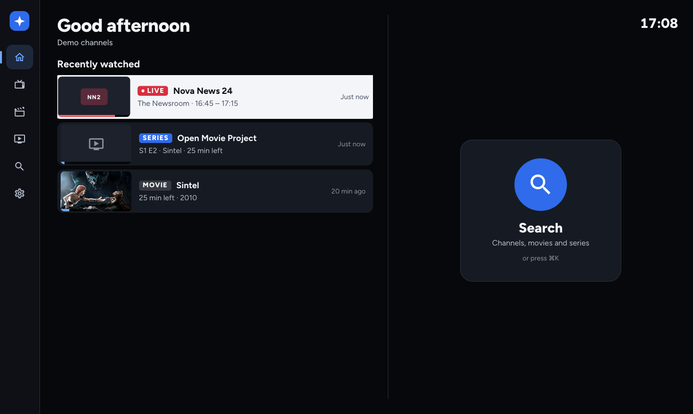
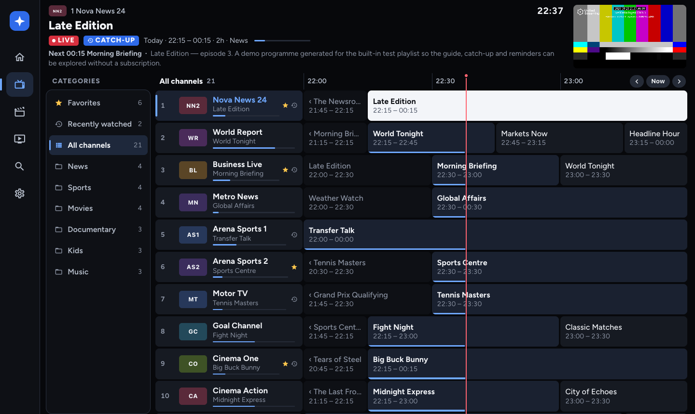
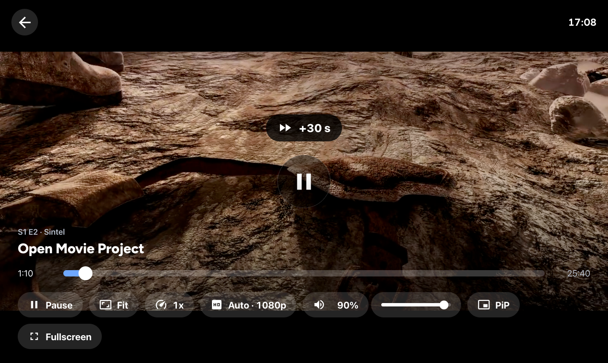
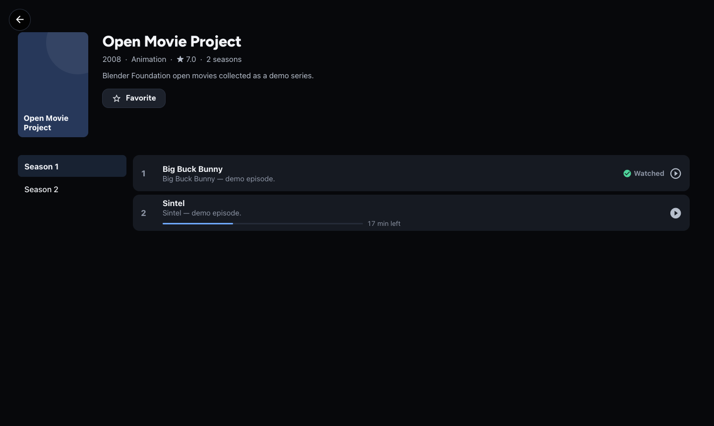
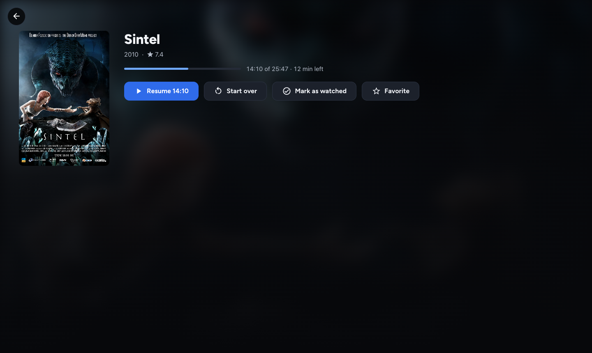
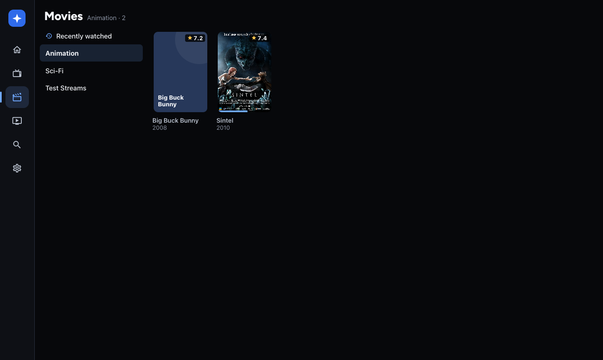
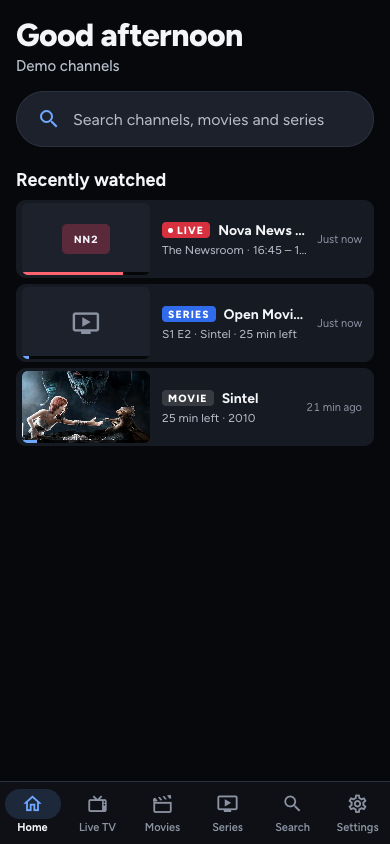
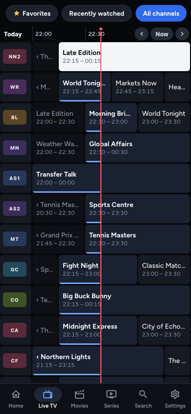

# Nova IPTV

An IPTV player for **Android TV / Fire TV (APK)**, **iOS (iPhone & iPad)** and the **web**, built from one TypeScript codebase (Expo SDK 57 / React Native 0.86).

Nova is a player only: it ships no channels. Add your provider's M3U link, an M3U file, or an Xtream Codes login. A built-in demo playlist of public test streams lets you try every screen without a subscription.

## Download (Fire TV / Android TV)

In the **Downloader** app on your Fire TV, enter:

```
https://github.com/TheLoop705/nova-iptv/releases/latest/download/Nova-firetv.apk
```

All builds are listed on the [Releases](https://github.com/TheLoop705/nova-iptv/releases) page.

## Screenshots

| Home | Live TV |
| --- | --- |
|  |  |
| **Player** | **Series** |
|  |  |
| **Movie** | **Movies** |
|  |  |

<p>
  
  
</p>

## Features

- **Home**: *Recently watched* mixes live channels, movies and series episodes, newest first, with where you left off. Selecting a series continues it (the next episode once one is finished). *Favorite channels* sits below.
- **Watch progress** for every movie and episode: resume points, "12 min left", and a *Watched* mark once finished (or set by hand). It's kept when the page reloads, and on the web it's shared between browsers through the Nova server.
- **Live TV guide (EPG grid)**: categories, channels with what's on now, and the timeline grid side by side, with a slim programme strip and live preview on top, a now-line, and number-key channel entry.
- **Favorite categories**: star any Live TV, movie or series category from its menu and it moves to the top of the list.
- **Menus everywhere**: Menu or long-press OK on the remote, long-press on touch, and a right-click context menu on the web. Channels, programmes, categories, posters, Home cards and episodes each have one.
- **Playlists**: M3U/M3U8 URL, M3U file import, Xtream Codes (live, movies, series, account info). Multiple playlists with fast switching.
- **XMLTV guides**: streamed and parsed incrementally (gzip supported). The guide URL is auto-detected from `url-tvg`/`x-tvg-url`, or uses Xtream's `xmltv.php`. There's a per-channel fallback via `get_simple_data_table`.
- **Catch-up**: Xtream `timeshift` and M3U `catchup` types (`default`, `append`, `shift`, `flussonic`, `fs`).
- **Player**: channel up/down zapping, mini channel list, info overlay with progress and next programme, last-channel recall (`0`), audio/subtitle tracks, aspect modes (fit/zoom/stretch), restart the current show from catch-up.
- **Movies & Series** (Xtream and M3U VOD): category browser, poster grid, detail pages, seasons/episodes, resume positions, favorites, recently watched.
- **Favorites, recents, hidden groups, search** across channels, movies and series, with forgiving matching for dictated queries ("n tv" → n-tv, "channel four" → Channel 4, "canal plus" → Canal+).
- **Voice search**: hold **☰ Menu** on the remote (or press a remote's Search/Assistant key, or `/` on the web) to jump to Search with the keyboard open. On Fire TV, then hold the remote's **mic** button and speak: the Fire TV keyboard types what you say. Amazon reserves the mic button for Alexa, so apps can't receive it directly. On the web there's a mic button (needs HTTPS or localhost); on phones use the keyboard's mic.
- **Remote-first navigation**: every screen works with a D-pad (Fire TV remote, Android TV remote, keyboard arrows on the web). Touch and mouse work everywhere too.

## Player

Each platform follows its own conventions:

| | Fire TV / Android TV | iPhone / iPad | Web |
| --- | --- | --- | --- |
| Engine | ExoPlayer (Media3) | AVPlayer for HLS/MP4, VLC for MKV/AVI/TS + automatic fallback | hls.js / mpegts.js / `<video>` |
| System integration | Media session → Alexa voice transport controls ("Alexa, pause / rewind"), Bluetooth/HDMI-CEC media keys | Lock screen & Control Center (Now Playing), AirPlay, Picture in Picture (auto when leaving the app) | Media Session API (OS media overlay, hardware media keys; next/previous = channel zapping), Picture in Picture, true browser fullscreen |
| Controls | D-pad, remote play/pause/FF/RW (10 s, hold to accelerate), channel keys, number entry, Menu = options | Tap to show/hide, double-tap sides ±10 s, swipe down to close, pinch to fill | Click, double-click fullscreen, volume slider, YouTube keyboard shortcuts; moving the mouse shows the cursor and controls, which hide again when idle |

Everywhere: speed 0.5–2×, audio/subtitle tracks, aspect (fit/zoom/stretch), resume, "Up next" episode countdown, and live streams that reconnect by themselves (3 attempts with backoff, stall watchdog, reload at the live edge after the app returns from the background). Web also has a manual quality picker (Auto + 1080p/720p/…) and starts muted when the browser blocks autoplay, with "Tap to unmute".

## Layout

| Path | What it is |
| --- | --- |
| `src/screens/` | Home, guide, movies/series, details, search, settings, playlist editor |
| `src/player/` | `VideoLayer` (one surface that moves between preview and fullscreen), `VideoSurface.tsx` (expo-video: ExoPlayer/AVPlayer), `VideoSurface.web.tsx` (hls.js + mpegts.js), `PlayerOverlay` |
| `src/services/` | M3U parser, Xtream client, streaming XMLTV parser, catch-up URL builders, storage, HTTP |
| `src/input/` | Key router: web keyboard, Android remote, Back button → one focus model |
| `src/store/` | zustand stores: settings (persisted), library (channels/EPG/VOD), player, UI |
| `modules/remote-keys/` | Local Expo module (Kotlin) that captures D-pad/media keys on Android TV before Android's native focus system |
| `plugins/withAndroidTV.js` | Config plugin: leanback launcher, TV banner, no touchscreen requirement |
| `server/index.mjs` | Web server: serves the web build and the `/api/proxy` stream/CORS proxy |
| `server/mock-xtream.mjs` | Dev-only fake Xtream panel (user `demo` / pass `demo`) |

## Development

```bash
npm install
npm run proxy          # terminal 1: CORS/stream proxy on :8787
npm run web            # terminal 2: Expo web on :8081 (uses the proxy)
npm run mock:xtream    # optional: fake Xtream panel on :8790
```

Keyboard on web: arrows = D-pad, Enter = OK (hold for the long-press menu), Esc/Backspace = Back, `o` = options, `/` or Ctrl+K / ⌘K = search, right-click = context menu, PageUp/PageDown = channel up/down, digits = channel number. In the player (YouTube-style): Space/`k` play-pause, `j`/`l` −/+10 s, `m` mute, `f` fullscreen, `c` subtitles, `<`/`>` speed, `p` picture-in-picture, `+`/`-` volume.

## Android TV / Fire TV APK

Requirements: JDK 17+ and the Android SDK (platform 36, build-tools 36, NDK 27.1).

```bash
npx expo prebuild --platform android
cd android
./gradlew assembleRelease -PreactNativeArchitectures=armeabi-v7a,arm64-v8a
# → android/app/build/outputs/apk/release/app-release.apk
```

Install on a Fire TV:

1. Fire TV **Settings → My Fire TV → Developer options**: turn on **ADB debugging** and **Apps from unknown sources** (or allow the Downloader app).
2. Either `adb connect <fire-tv-ip>:5555 && adb install -r app-release.apk`, or host the APK somewhere and open it with the **Downloader** app.
3. Nova appears in **Your Apps & Channels** with its TV banner.

The release build is signed with the debug keystore, which is fine for sideloading. To publish to a store, create a keystore and add a release `signingConfig`.

## iOS

```bash
npx expo prebuild --platform ios
cd ios && LANG=en_US.UTF-8 pod install && cd ..
npx expo run:ios --configuration Release        # simulator
# or open ios/Nova.xcworkspace in Xcode, set your team, and run on a device / archive
```

iOS uses two playback engines (Settings → Playback → Video player):

- **Apple's player (AVPlayer)** for HLS and MP4: hardware-friendly and battery-efficient. Nova asks Xtream panels for `.m3u8` live streams on iOS.
- **VLC (MobileVLCKit)** for everything AVPlayer can't open (MKV, AVI, raw MPEG-TS, FLV, extension-less panel links, MP2 audio, …), and automatically whenever AVPlayer fails on a stream. Most Xtream movies are MKV, so they play through VLC.

`nova://play?url=<stream-url>&title=<name>` opens any stream URL directly (handy for testing a link).

MobileVLCKit is LGPL-2.1 and is pulled in from CocoaPods (~260 MB download on first `pod install`).

## Web

```bash
npm run build:web                  # → dist/
PORT=8787 BASIC_AUTH=me:secret npm run serve
```

On a machine that hosts Nova for the house, `scripts/deploy-local.sh` builds the web app from a clean checkout of HEAD, so uncommitted work never ships. It installs the build and the server into `~/.nova-iptv/app`, then restarts the LaunchAgent that runs it (`NOVA_APP_DIR` and `NOVA_AGENT` override both).

`build:web` also writes Brotli/gzip copies of the bundle and fonts (`scripts/compress-dist.mjs`). The server sends those with long-lived caching for hashed files and ETags for the rest, and gzips proxied playlists, guide data and Xtream API responses on the fly.

Browsers can't reach most IPTV servers directly (no CORS headers, `http://` on an `https://` page, required User-Agents), so the web build sends playlist, guide and stream requests through `/api/proxy`. HLS playlists are rewritten so segments also go through it.

Playlists, favourites, watch progress and settings are saved on the server in SQLite (`~/.nova-iptv/nova.db`, override with `NOVA_DB`), not in the browser. A refresh or cleared site data loses nothing, and every browser that opens the server sees the same library. Changes are saved per field, so two devices editing different things don't overwrite each other, and a tab picks up other devices' changes when you switch back to it. The active playlist stays per device. Channel and guide caches stay in each browser's IndexedDB. The database holds playlist credentials, so back it up like any other secret and set `BASIC_AUTH` if the server is reachable beyond your LAN.

Proxy safety:

- **Set `BASIC_AUTH=user:pass` before exposing the server to the internet**, otherwise anyone can use it as a proxy.
- Loopback, LAN, link-local/cloud-metadata, CGNAT/Tailscale and other internal addresses are refused by default. The check runs at connect time and on every redirect hop, so DNS tricks and redirects can't get around it. If your IPTV source lives on your own network (e.g. TVHeadend), set `ALLOW_PRIVATE=1`.
- `ALLOWED_HOSTS=provider.com,cdn.provider.net` restricts the proxy to your provider's hosts (subdomains included).
- `npm run proxy` (development) binds to 127.0.0.1 with `ALLOW_PRIVATE=1` so the local mock panel works.

## Notes

- Guide data is cached (IndexedDB on web, JSON files in the app's documents directory on native) and refreshed every 12 h by default (Settings → TV Guide).
- The default User-Agent is `Nova/1.0 … ExoPlayerLib/2.19.1`. Some providers require a specific one: set it per playlist or globally in Settings.
