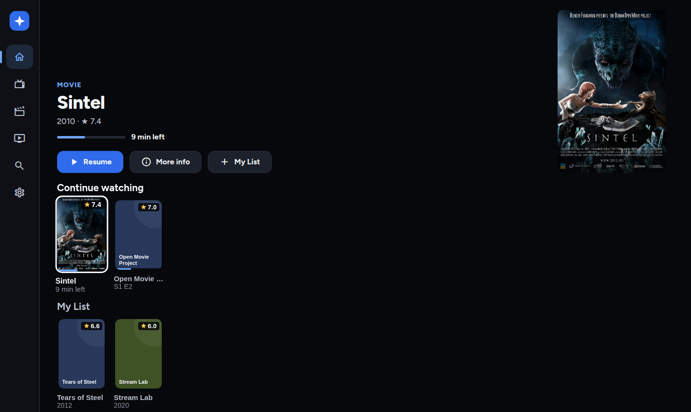
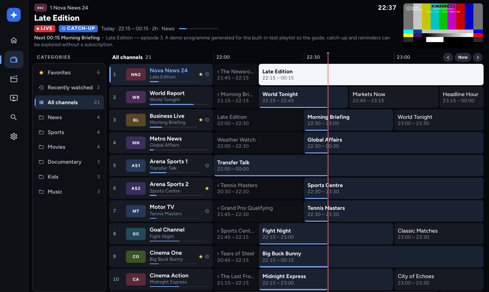
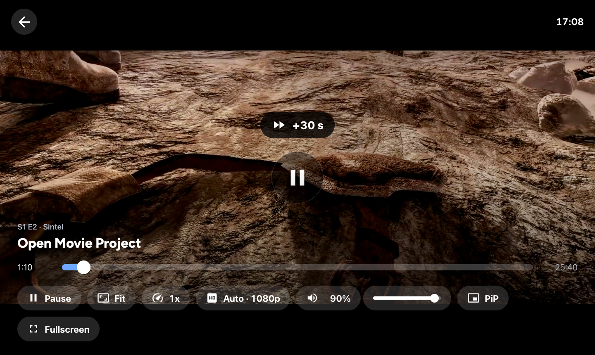
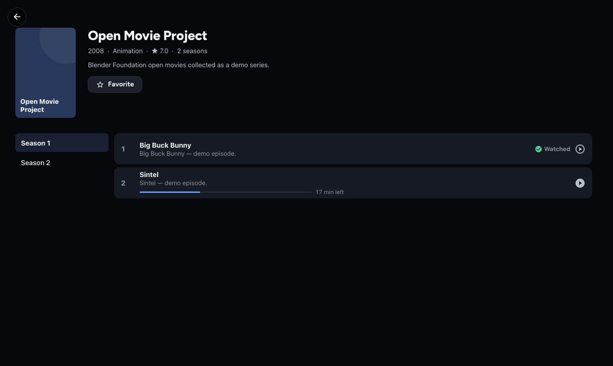
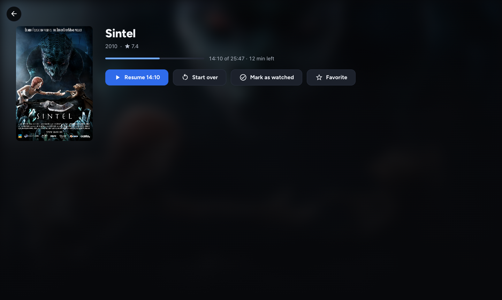
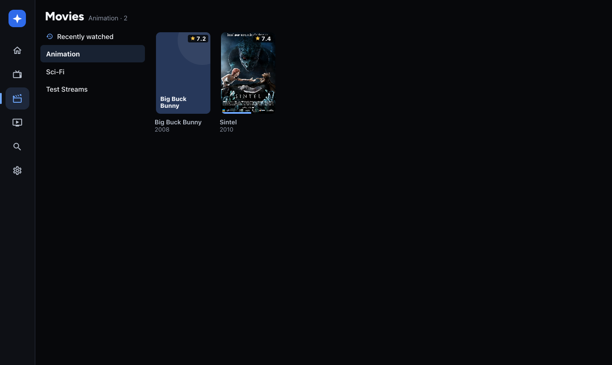
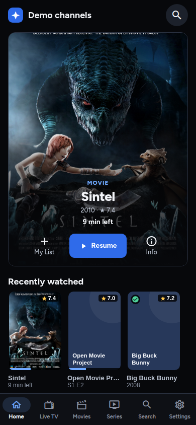
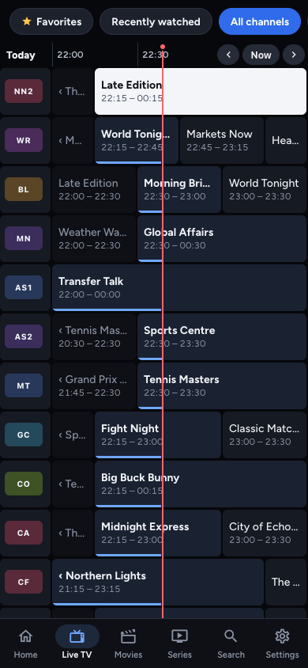

# Nova IPTV

An IPTV player for **Android TV / Fire TV (APK)**, **Windows (x64 installer)**, **iOS (iPhone & iPad)** and the **web**, built from one TypeScript codebase (Expo SDK 57 / React Native 0.86). Windows uses Electron to run the web player with its own bundled local service.

Nova is a player only: it ships no channels. Add your provider's M3U link, an M3U file, or an Xtream Codes login. A built-in demo playlist of public test streams lets you try every screen without a subscription.

## Download (Fire TV / Android TV)

In the **Downloader** app on your Fire TV, enter:

```
https://github.com/TheLoop705/nova-iptv/releases/latest/download/Nova-firetv.apk
```

All builds are listed on the [Releases](https://github.com/TheLoop705/nova-iptv/releases) page.

**Updates install from inside the app** (1.6.0 and later). Nova checks the latest GitHub release shortly after it starts. On Fire TV, when there's a newer version it offers *Update now*, downloads the Fire TV APK and opens Android's installer. *Settings → Check for updates* does the same on demand. The first time, Fire TV asks you to allow Nova to install apps; after that it's a single confirmation. Automated releases currently provide only the 32-bit Fire TV APK. In-app updates on other Android devices require a universal APK, whose automated build is paused.

**Web updates** (1.7.0 and later): the page checks its Nova server at startup, every five minutes while visible, and when returning to the tab. *Settings → Check for updates* checks immediately. When a new web build is deployed, *Reload and update* saves pending settings and reloads it. Deploy `dist/version.json` together with the exported site. Web updates load a version already deployed by the server owner; Android updates download the APK from GitHub. iPhone builds still require a signed installation through Xcode or the connected Mac.

**Phone setup** (1.7.0): on Fire TV / Android TV, open *Add playlist* and scan the QR code with a phone on the same trusted Wi-Fi. Submit an M3U URL or Xtream Codes details, then review and save on the TV. Each code is single-use and expires after ten minutes or when the editor closes. The editor scrolls its focused control into view, including Add playlist and Cancel.

## Screenshots

| Home | Live TV |
| --- | --- |
|  |  |
| **Player** | **Series** |
|  |  |
| **Movie** | **Movies** |
|  |  |

<p>
  
  
</p>

## Features

- **Home** (the start page) is for movies and series, laid out like Netflix; live channels stay in Live TV. On TV and desktop a billboard at the top shows the focused title: artwork, year, genre, running time, rating, plot, and *Play*/*Resume*, *More info* (or *Episodes*) and *My List*. Press ▲ from the first row to reach those buttons. Below are rows of posters: *Recently watched* (the movies and TV shows you've watched, newest first: OK resumes a movie, or carries a show on from the right episode), *My List* (your favourite movies and series), then categories. Categories you've starred come first, then the ones you've been watching from, then movies and series alternating in your provider's order. Long rows end in a *See all* card that opens the category in Movies or Series. On phones, a featured title card sits above the same rows. With a mouse, the billboard follows the pointer and arrows at the ends of a row page through it.
- **Watch progress** for every movie and episode: resume points, "12 min left", and a *Watched* mark once finished (or set by hand). It's kept when the page reloads, and on the web it's shared between browsers through the Nova server.
- **Watch history you control**: *Remove from history* on a poster's menu (Home, Movies, Series) or a channel's menu (Live TV) forgets that title: it leaves the recently watched lists, and its resume points and Watched marks go too (for a series, every episode). *Settings → Watch history → Clear watch history* does it for the whole playlist, or for all playlists. Favorites and My List are kept.
- **Series remember where you are.** Opening a show (from Home, Series or Search) lands on the episode to carry on with: the one you're part way through, marked *Continue*, or the next one once you've finished it, marked *Up next*. The right season is selected, the list is scrolled to it, and OK plays it; *Resume S2 E5* / *Continue S2 E6* at the top does the same. Coming back from the player follows along to the episode you reached. Search results show the last episode you watched.
- **Live TV guide (EPG grid)**: categories, channels with what's on now, and the timeline grid side by side, with a slim programme strip and live preview on top, a now-line, and number-key channel entry.
- **Favorite categories**: star any Live TV, movie or series category from its menu and it moves to the top of the list.
- **Menus everywhere**: Menu or long-press OK on the remote, long-press on touch, and a right-click context menu on the web. Channels, programmes, categories, posters, Home cards and episodes each have one.
- **Playlists**: M3U/M3U8 URL, M3U file import, Xtream Codes (live, movies, series, account info). Multiple playlists with fast switching. On Fire TV / Android TV, scan the QR code in **Add playlist** to enter provider details from a phone on the same Wi-Fi network.
- **XMLTV guides**: streamed and parsed incrementally (gzip supported). The guide URL is auto-detected from `url-tvg`/`x-tvg-url`, or uses Xtream's `xmltv.php`. There's a per-channel fallback via `get_simple_data_table`.
- **Catch-up**: Xtream `timeshift` and M3U `catchup` types (`default`, `append`, `shift`, `flussonic`, `fs`).
- **Player**: channel up/down zapping, mini channel list, info overlay with progress and next programme, last-channel recall (`0`), audio/subtitle tracks, aspect modes (fit/zoom/stretch), restart the current show from catch-up.
- **Movies & Series** (Xtream and M3U VOD): category browser, poster grid, detail pages, seasons/episodes, resume positions, favorites, recently watched.
- **Favorites, recents, hidden groups, search** across channels, movies and series, with forgiving matching for dictated queries ("n tv" → n-tv, "channel four" → Channel 4, "canal plus" → Canal+).
- **Voice search**: hold **☰ Menu** on the remote (or press a remote's Search/Assistant key, or `/` on the web) to jump to Search with the keyboard open. On Fire TV, then hold the remote's **mic** button and speak: the Fire TV keyboard types what you say. Amazon reserves the mic button for Alexa, so apps can't receive it directly. On the web there's a mic button (needs HTTPS or localhost); on phones use the keyboard's mic.
- **Remote-first navigation**: every screen works with a D-pad (Fire TV remote, Android TV remote, keyboard arrows on the web). Touch and mouse work everywhere too.

## Player

Each platform follows its own conventions:

| | Fire TV / Android TV | iPhone / iPad | Web |
| --- | --- | --- | --- |
| Engine | ExoPlayer (Media3) | AVPlayer for HLS/MP4, VLC for MKV/AVI/TS + automatic fallback | hls.js / mpegts.js / `<video>` |
| System integration | Media session → Alexa voice transport controls ("Alexa, pause / rewind"), Bluetooth/HDMI-CEC media keys | Lock screen & Control Center (Now Playing), AirPlay, Picture in Picture (auto when leaving the app) | Media Session API (OS media overlay, hardware media keys; next/previous = channel zapping), Picture in Picture, true browser fullscreen |
| Controls | D-pad ◀ ▶ and the remote's ⏪ ⏩ rewind / fast-forward (10 s, hold for 30 s then 60 s steps, with a running total on screen), channel keys, number entry, Menu = options | Tap to show/hide, double-tap sides ±10 s, swipe down to close, pinch to fill | Click, double-click fullscreen, volume slider, YouTube keyboard shortcuts; moving the mouse shows the cursor and controls, which hide again when idle |

Everywhere: speed 0.5–2×, audio/subtitle tracks, aspect (fit/zoom/stretch), resume, a **Next episode** button during the credits (OK plays it on TV), an "Up next" countdown at the very end, and live streams that reconnect by themselves (3 attempts with backoff, stall watchdog, reload at the live edge after the app returns from the background). Web also has a manual quality picker (Auto + 1080p/720p/…) and starts muted when the browser blocks autoplay, with "Tap to unmute".

## Layout

| Path | What it is |
| --- | --- |
| `src/screens/` | Home, guide, movies/series, details, search, settings, playlist editor |
| `src/player/` | `VideoLayer` (one surface that moves between preview and fullscreen), `VideoSurface.tsx` (expo-video: ExoPlayer/AVPlayer), `VideoSurface.web.tsx` (hls.js + mpegts.js), `PlayerOverlay` |
| `src/services/` | M3U parser, Xtream client, streaming XMLTV parser, catch-up URL builders, storage, HTTP |
| `src/input/` | Key router: web keyboard, Android remote, Back button → one focus model |
| `src/store/` | zustand stores: settings (persisted), library (channels/EPG/VOD), player, UI |
| `modules/remote-keys/` | Local Expo module (Kotlin) that captures D-pad/media keys on Android TV before Android's native focus system |
| `plugins/withAndroidTV.js` | Config plugin: leanback launcher, TV banner, no touchscreen requirement |
| `server/index.mjs` | Web server: serves the web build and the `/api/proxy` stream/CORS proxy |
| `server/mock-xtream.mjs` | Dev-only fake Xtream panel (user `demo` / pass `demo`) |
| `desktop/` | Windows Electron shell, installer configuration and isolated desktop build dependencies |

## Development

```bash
npm install
npm run proxy          # terminal 1: CORS/stream proxy on :8787
npm run web            # terminal 2: Expo web on :8081 (uses the proxy)
npm run mock:xtream    # optional: fake Xtream panel on :8790
```

Checks: `npx tsc --noEmit`, `npm run test:updates` (Node 22.18+), and, after Android prebuild, `cd android && ./gradlew :playlist-pairing:testDebugUnitTest`. The pairing tests exercise real HTTP requests for M3U/Xtream submission, validation, single-use codes, expiration, and editor-close cancellation.

Performance checks: `npm run test:performance` exercises large guides, catalogs, search, cancellation and caches. `npm run build:perf:web && npm run test:e2e` tests the production web app with a large local provider, real remote navigation and measured responsiveness. [Testing instructions](docs/performance-testing.md) cover private `.env` credentials, Windows, Android TV emulation and physical Fire TV checks. [Performance review](docs/performance-review.md) records the findings, measurements and remaining device coverage.

Keyboard on web: arrows = D-pad, Enter = OK (hold for the long-press menu), Esc/Backspace = Back, `o` = options, `/` or Ctrl+K / ⌘K = search, right-click = context menu, PageUp/PageDown = channel up/down, digits = channel number. In the player (YouTube-style): Space/`k` play-pause, `j`/`l` −/+10 s, `m` mute, `f` fullscreen, `c` subtitles, `<`/`>` speed, `p` picture-in-picture, `+`/`-` volume.

## Android TV / Fire TV APK

Requirements: JDK 17+ and the Android SDK (platform 36, build-tools 36, NDK 27.1).

```bash
npx expo prebuild --platform android
cd android
./gradlew --parallel --build-cache :app:assembleRelease -PreactNativeArchitectures=armeabi-v7a
# → android/app/build/outputs/apk/release/app-release.apk
```

Install on a Fire TV:

1. Fire TV **Settings → My Fire TV → Developer options**: turn on **ADB debugging** and **Apps from unknown sources** (or allow the Downloader app).
2. Either `adb connect <fire-tv-ip>:5555 && adb install -r app-release.apk`, or host the APK somewhere and open it with the **Downloader** app.
3. Nova appears in **Your Apps & Channels** with its TV banner.

The release build is signed with the debug keystore, which is fine for sideloading. To publish to a store, create a keystore and add a release `signingConfig`.

### Automated GitHub releases

Every push to `master` runs `.github/workflows/android-release.yml`. Typechecking, update tests and native pairing tests run in a separate job alongside the 32-bit Fire TV APK build. Publication waits for both jobs to succeed, verifies the transferred APK's SHA-256 checksum, and publishes a new latest GitHub release with `Nova-firetv.apk` and `SHA256SUMS.txt`. Universal APK builds are paused. CI versions append the workflow run number to `app.json`'s version (for example `1.6.0.4`) so in-app updates remain ordered without modifying source files.

The APK build targets `:app:assembleRelease`, enables Gradle's build cache and parallel execution, and restores cached Gradle state between runs. It avoids a redundant Gradle `clean` on the fresh runner. Each build also uploads a `firetv-build-profile` artifact containing Gradle task timings for diagnosing remaining bottlenecks. The first build after dependency changes can still take longer while caches warm up.

The workflow restores the update-compatible keystore from the `NOVA_ANDROID_KEYSTORE_BASE64` repository secret. Never commit that keystore or its encoded contents.

The Windows installer builds and runs its desktop checks in parallel. After the Fire TV release is published, a separate job attaches `Nova-windows-x64-Setup.exe`, `SHA256SUMS-windows.txt` and `Nova-winget-manifests.zip` to the same release. Windows never blocks publication of the APK. Windows file versions and the installed version use the same four-component release number as the tag. Electron's internal package metadata retains the three-component source version. Local builds use a final component of `0`.

Windows release assets are preserved on workflow reruns: replacing a published installer would invalidate WinGet's recorded hash. Publish a new numbered release for any changed installer.

## Windows

Download **Nova-windows-x64-Setup.exe** from [GitHub Releases](https://github.com/TheLoop705/nova-iptv/releases), run the installer, and open Nova from the Start menu or desktop shortcut. The installer includes everything needed; Node.js and a separate Nova server are not required. Installers are currently unsigned, so Windows may show a SmartScreen warning.

Windows uses the web player's HLS/MP4 and MPEG-TS support, keyboard shortcuts, mouse controls and picture-in-picture. Codec support follows the bundled Chromium player; it does not include the iOS VLC engine. Press **F11** for fullscreen, **Ctrl+K** to search, or **Alt** to reveal the menu. **Help → Get updates** opens the release downloads; installing a newer Windows build preserves saved data. Automatic desktop updates are not implemented yet.

Playlists, credentials, favourites, watch progress and settings are stored on this PC in `%APPDATA%\Nova\nova.db`; caches live in the same Nova data directory. These are separate from any Nova web server's library. The bundled service binds only to a random loopback port and requires a credential held by the desktop process. LAN providers work without extra configuration.

Build on Windows with Node.js 22.12+:

```bash
npm ci
npm ci --prefix desktop
npm run windows         # export the desktop web bundle and launch Nova
npm run build:windows   # → release/windows/Nova-windows-x64-Setup.exe
npm run test:windows    # after export: startup, restart persistence, proxy and codec checks
```

Electron dependencies live in `desktop/package-lock.json` so Android builds do not install the desktop toolchain. The generated desktop app is staged in `.desktop/`; source changes belong in `desktop/`, `server/` or the shared app under `src/`.

### WinGet distribution

The package identifier is **TheLoop705.NovaIPTV**. The [first submission (1.7.0.5)](https://github.com/microsoft/winget-pkgs/pull/441917) is pending review. It must be approved and indexed by the WinGet community repository before these commands work:

```powershell
winget install --id TheLoop705.NovaIPTV --exact --source winget
winget upgrade --id TheLoop705.NovaIPTV --exact --source winget
```

Each numbered CI release generates a `Nova-winget-manifests.zip` containing the three YAML manifests under `manifests/t/TheLoop705/NovaIPTV/<version>/`. These use a versioned GitHub installer URL, the exact installer's SHA-256, its installed product ID, and silent installation switches. The archive is ready to submit as a new version PR to `microsoft/winget-pkgs`; publishing a GitHub release alone does not update the WinGet catalog. This does not require a Microsoft Store listing.

For a submission, download the archive from the published release, extract it, validate with `winget validate --manifest <version-directory>`, and check installation and uninstallation before submitting. Do not regenerate a manifest from a different local rebuild or change an existing release's installer. [Windows privacy information](desktop/PRIVACY.md).

## iOS

```bash
npx expo prebuild --platform ios
cd ios && LANG=en_US.UTF-8 pod install && cd ..
npx expo run:ios --configuration Release        # simulator
# or open ios/Nova.xcworkspace in Xcode, set your team, and run on a device / archive
```

iOS uses two playback engines (Settings → Playback → Video player):

- **Apple's player (AVPlayer)** for HLS and MP4: hardware-friendly and battery-efficient. Nova asks Xtream panels for `.m3u8` live streams on iOS.
- **VLC (MobileVLCKit)** for everything AVPlayer can't open (MKV, AVI, raw MPEG-TS, FLV, extension-less panel links, MP2 audio, …), and automatically whenever AVPlayer fails on a stream. Most Xtream movies are MKV, so they play through VLC.

`nova://play?url=<stream-url>&title=<name>` opens any stream URL directly (handy for testing a link).

MobileVLCKit is LGPL-2.1 and is pulled in from CocoaPods (~260 MB download on first `pod install`).

## Web

```bash
npm run build:web                  # → dist/
PORT=8787 BASIC_AUTH=me:secret npm run serve
```

On a machine that hosts Nova for the house, `scripts/deploy-local.sh` builds the web app from a clean checkout of HEAD, so uncommitted work never ships. It installs the build and the server into `~/.nova-iptv/app`, then restarts the LaunchAgent that runs it (`NOVA_APP_DIR` and `NOVA_AGENT` override both).

`build:web` also writes Brotli/gzip copies of the bundle and fonts (`scripts/compress-dist.mjs`). The server sends those with long-lived caching for hashed files and ETags for the rest, and gzips proxied playlists, guide data and Xtream API responses on the fly.

Browsers can't reach most IPTV servers directly (no CORS headers, `http://` on an `https://` page, required User-Agents), so the web build sends playlist, guide and stream requests through `/api/proxy`. HLS playlists are rewritten so segments also go through it.

Playlists, favourites, watch progress and settings are saved on the server in SQLite (`~/.nova-iptv/nova.db`, override with `NOVA_DB`), not in the browser. A refresh or cleared site data loses nothing, and every browser that opens the server sees the same library. Changes are saved per field, so two devices editing different things don't overwrite each other, and a tab picks up other devices' changes when you switch back to it. The active playlist stays per device. Channel and guide caches stay in each browser's IndexedDB. The database holds playlist credentials, so back it up like any other secret and set `BASIC_AUTH` if the server is reachable beyond your LAN.

Proxy safety:

- **Set `BASIC_AUTH=user:pass` before exposing the server to the internet**, otherwise anyone can use it as a proxy.
- Loopback, LAN, link-local/cloud-metadata, CGNAT/Tailscale and other internal addresses are refused by default. The check runs at connect time and on every redirect hop, so DNS tricks and redirects can't get around it. If your IPTV source lives on your own network (e.g. TVHeadend), set `ALLOW_PRIVATE=1`.
- `ALLOWED_HOSTS=provider.com,cdn.provider.net` restricts the proxy to your provider's hosts (subdomains included).
- `npm run proxy` (development) binds to 127.0.0.1 with `ALLOW_PRIVATE=1` so the local mock panel works.

## Notes

- **Startup**: Nova shows its launch screen until settings are read, then the library it saved last time, and refreshes in the background. Startup loads movies and series only; **Live TV channels load when you open Live TV** (Search loads them too, for its channel results, and so does *Start with last channel*). On Xtream, signing in runs alongside so a wrong password or an expired account is still reported, and each Home row loads its category when it comes near the screen. An M3U playlist is downloaded once and saved in two parts, so starting the app reads only its movies. A playlist loading for the first time shows a loading screen with what's happening ("Downloading playlist… 4.2 MB").
- **Caches** (IndexedDB on web, JSON files in the app's documents directory on native): the channel list and an M3U playlist's movies (refreshed in the background after 24 h), Xtream movie and series categories and each category's titles (after 12 h; an empty answer from the provider never replaces a saved list), and the guide. *Refresh now* on a playlist re-reads all of them.
- Guide data loads the first time it's needed (Live TV, a live channel, Search or Settings), not at startup, and is refreshed every 12 h by default (Settings → TV Guide).
- Large channel/guide caches use small pages. Native installations refresh the previous large cache once after this upgrade to avoid blocking while reading it.
- Settings displays exact movie/series totals after those catalogs have loaded. Choose **Count movies and series** to calculate them in the background; simply opening Settings does not download both catalogs.
- The default User-Agent is `Nova/1.0 … ExoPlayerLib/2.19.1`. Some providers require a specific one: set it per playlist or globally in Settings.
